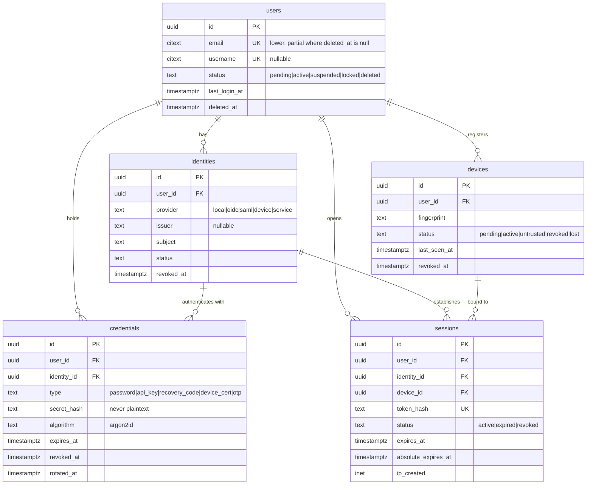
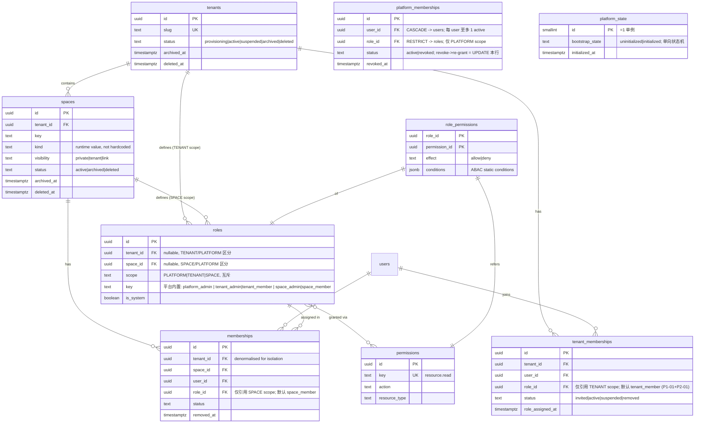
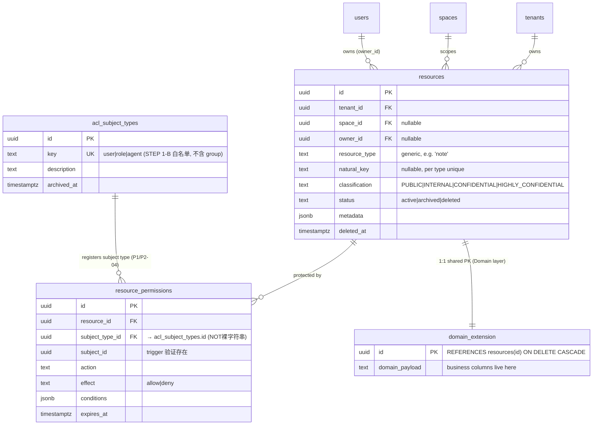
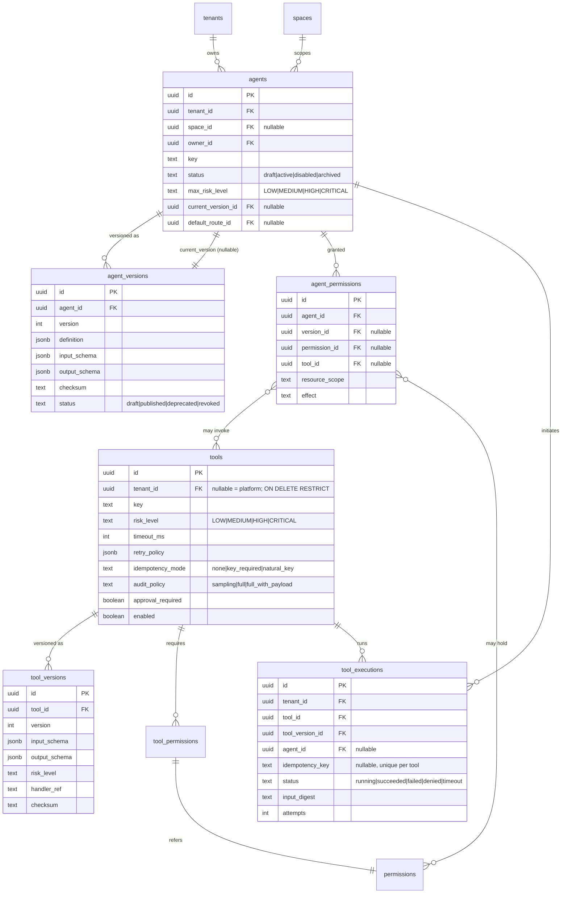
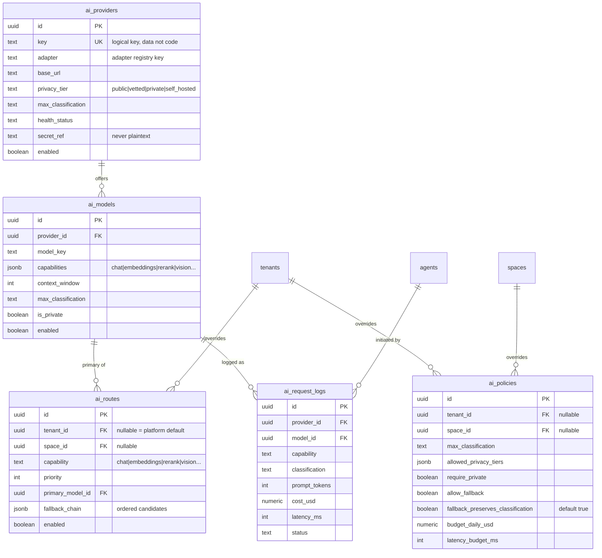
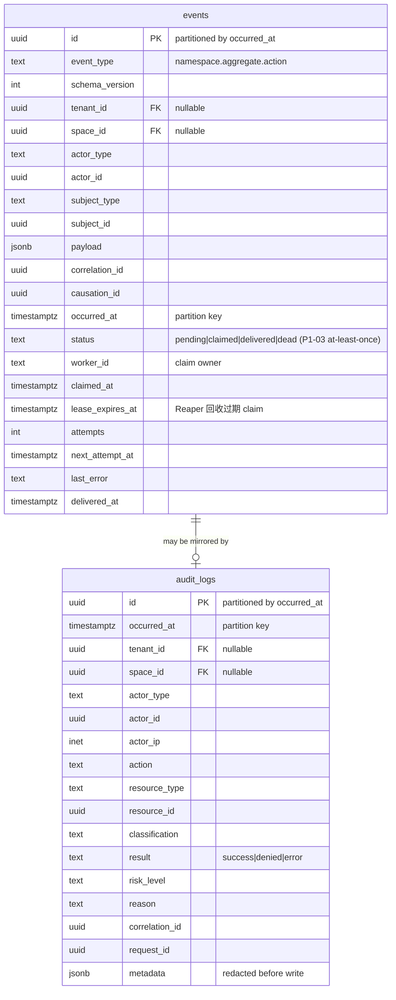

# UAP Core ER Model

Status: **DESIGN — STEP 1-A（Round 3 修订完成）**
配套文档：[CORE_DOMAIN_MODEL.md](./CORE_DOMAIN_MODEL.md)

> 图中只画主键、外键与关键字段。完整字段见 Entity Catalog。
> 符号：`||--o{` 1:N，`||--||` 1:1，`}o--o{` N:M。

---

## 1. Identity：User / Identity / Device / Session / Credential

**关键点**
- `users` 1:N `identities` —— 一人多种登录方式，不合并成一张宽表
- `credentials` 挂在 `identity` 上（密码属于某个身份），同时冗余 `user_id` 便于检索
- `devices` 1:N `sessions` —— 多设备、每设备多会话
- 设备撤销级联撤销其 active session（应用层同事务，非 DB trigger）

---

## 2. Tenant / Space / Membership / Role / Permission

**关键点**
- 用户跨租户：`users` 全局，通过 `tenant_memberships` 归属（1 用户可属 N 租户）
- 用户跨空间：`memberships` 以 `(space_id, user_id)` 唯一（1 用户可属 N 空间）
- `platform_memberships`（**2026-09-08 D-07 Round 3 决策增补，当前未建表**）：PLATFORM role 唯一绑定载体；`role_id` 仅允许 scope='PLATFORM' 的 role；见 `STEP1B_B1_3_DECISION_LOG.md` R3-2
- `memberships.tenant_id` 冗余列 → 隔离索引 + RLS 可用，trigger 保证与 `spaces.tenant_id` 一致
- `roles` 三作用域用部分唯一索引互斥；`role_permissions` 是 N:M 联结并携带 `effect` 与 ABAC 条件

---

## 3. Resource / Resource Permission

**关键点**
- **共享主键 1:1**：域业务表 `id` 同时是 PK 与 FK → 有外键强约束，避免无 RI 的多态弱引用
- Core 只读写 `resources`；Domain 只读写自己的扩展表 → 双向解耦
- `resource_permissions` 是显式 ACL，deny 优先于 RBAC 继承来的 allow
- **P1/P2-04 ACL subject 注册**：通过 `acl_subject_types` 表把"ACL 主体是 user/role/agent"这件事从字符串拼接升级为**注册表 + trigger 验证**：subject 写入前 trigger 检查 `subject_type_id` 必须在注册表中 active 且 `subject_id` 必须在对应表存在；**P2-02：STEP 1-B 白名单不含 `group`，trigger 不引用 `groups` 表**（未来 `group` 需先建表 → 注册 → 扩展 trigger validation，见 STEP1A_ARCHITECTURE_REVIEW Round 3）

---

## 4. Agent / Agent Version / Tool / Tool Version

**关键点**
- Agent 与 Model 完全解耦：Agent 通过 `default_route_id → ai_routes` 间接选模型
- Agent 无 DB 权限：`agent_permissions` 是白名单，未列出即拒绝；`agents` 表不存任何连接信息
- 已发布版本不可变（`agent_versions` / `tool_versions`）
- `tool_executions` 提供幂等锚点：`(tool_id, idempotency_key)` 唯一

---

## 5. AI Provider / Model / Route / Policy

**关键点**
- 厂商是**数据行**，Core 代码不 import 任何 SDK（架构守卫持续强制）
- `ai_policies` 约束 `ai_routes`：fallback 链上每个候选都要重新校验 `max_classification` 与 `privacy_tier`
- 硬约束 `CK (allow_fallback = false OR fallback_preserves_classification = true)` 从数据库层面禁止"降级到公共模型"

---

## 6. Event / Audit

**关键点**
- `events` = **at-least-once** transactional outbox：与业务写入同事务；投递用 **CAS claim**（单行 UPDATE 上的 status 条件=乐观锁）取代纯 SKIP LOCKED；lease 过期由 Reaper 回收 → pending；状态机 `pending → claimed → delivered`，**绝不承诺 exactly-once**，消费方按 `event_id` 幂等
- `audit_logs` 不可变：无 `updated_at` / `deleted_at`，仅 `INSERT, SELECT`
- 两者都是按月分区，到期整分区 drop

---

## 7. 关系矩阵总览

| 关系 | 基数 | FK | 删除策略 |
|---|---|---|---|
| users → identities | 1:N | `identities.user_id` | CASCADE |
| users → credentials | 1:N | `credentials.user_id` | CASCADE |
| users → devices | 1:N | `devices.user_id` | CASCADE |
| users → sessions | 1:N | `sessions.user_id` | CASCADE |
| identities → credentials | 1:N | `credentials.identity_id` | CASCADE |
| identities → sessions | 1:N | `sessions.identity_id` | RESTRICT |
| devices → sessions | 1:N | `sessions.device_id` | CASCADE |
| tenants → spaces | 1:N | `spaces.tenant_id` | **RESTRICT** |
| tenants → tenant_memberships | 1:N | `tenant_memberships.tenant_id` | CASCADE |
| tenants → roles | 1:N | `roles.tenant_id` | CASCADE |
| **roles (TENANT scope) → tenant_memberships** | 1:N | `tenant_memberships.role_id` | **RESTRICT**（P1-01 方案 A：Tenant Role 挂在 membership 上） |
| users → tenant_memberships | 1:N | `tenant_memberships.user_id` | CASCADE |
| spaces → memberships | 1:N | `memberships.space_id` | CASCADE |
| users → memberships | 1:N | `memberships.user_id` | CASCADE |
| roles → memberships | 1:N | `memberships.role_id` | RESTRICT |
| **acl_subject_types → resource_permissions** | 1:N | `resource_permissions.subject_type_id` | **RESTRICT**（P1/P2-04 注册表） |
| roles ↔ permissions | N:M | `role_permissions` | CASCADE / CASCADE |
| tenants → resources | 1:N | `resources.tenant_id` | **RESTRICT**（P2-03：资源不随租户删除级联） |
| spaces → resources | 1:N | `resources.space_id` | **RESTRICT**（P2-03：资源不随空间删除级联） |
| resources → resource_permissions | 1:N | `resource_permissions.resource_id` | CASCADE（技术子实体，随资源受控 purge） |
| resources → domain 扩展表 | 1:1 | 域表 `id` → `resources.id` | CASCADE（1:1 共享 PK，完全从属 registry，随受控 purge） |
| agents → agent_versions | 1:N | `agent_versions.agent_id` | CASCADE |
| agents → agent_permissions | 1:N | `agent_permissions.agent_id` | CASCADE |
| tools → tool_versions | 1:N | `tool_versions.tool_id` | CASCADE |
| tools → tool_permissions | 1:N | `tool_permissions.tool_id` | CASCADE |
| tools → tool_executions | 1:N | `tool_executions.tool_id` | RESTRICT |
| ai_providers → ai_models | 1:N | `ai_models.provider_id` | CASCADE |
| ai_models → ai_routes | 1:N | `ai_routes.primary_model_id` | RESTRICT |
| agents → ai_routes | N:1 | `agents.default_route_id` | SET NULL |

**规则（P2-03 统一）**：**业务数据实体**（`resources`、域扩展表及其承载内容）一律 `RESTRICT`；`ON DELETE CASCADE` **只允许**用于技术/关系子实体 —— sessions / credentials / devices / versions / 权限绑定 / 纯关系行 / ACL / 1:1 域扩展（随 registry 受控 purge）。完整白名单与逐项理由见 `CORE_DOMAIN_MODEL.md` §11.1。Tenant/Space 的资源清理走 archive → soft delete → retention → controlled purge，**不依赖数据库级联**。
